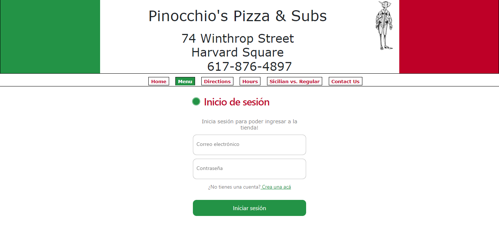
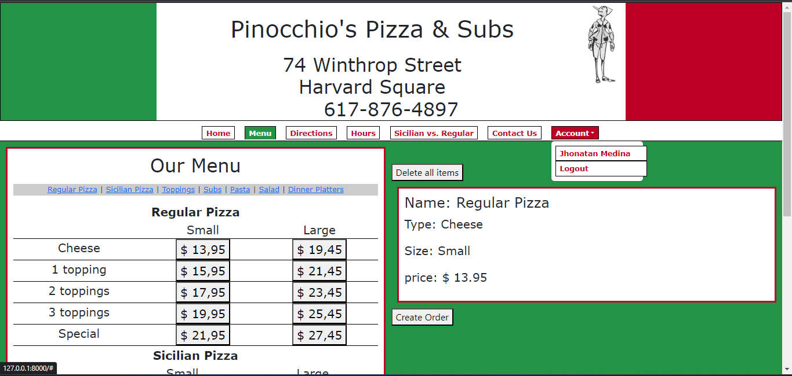
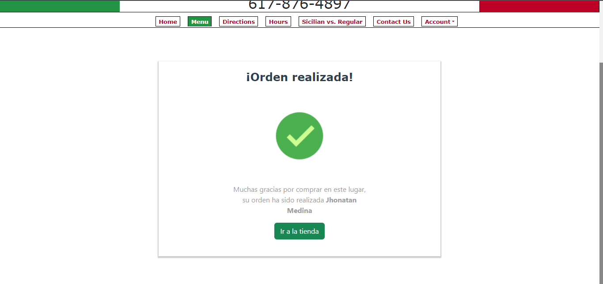

# Project3: Pizza

Basandome en la página http://www.pinocchiospizza.net/menu.html se realizó el siguiente project:

## Imagenes del proyecto

### Inicio de sesión

### Tienda

### Orden completada

 
## Instalación:

1. Clonar el repositorio
git clone `https://github.com/CyberMedina/cs50w-project4.git](https://github.com/CyberMedina/cs50w-project3.git)`
2. Crear un entorno virtual de Python `python -m venv env`, luego activarlo con `.\env\Scripts\activate`
3. Instalar los requerimientos del proyecto `pip install -r .\requirements.txt`
4. Renombrar el archivo ".env.template" a ".env" en la raíz del proyecto
5. Editar el archivo ".env" con los datos de conexión de la base de datos PostgreSQL
6. Crear migraciones `python manage.py makemigrations`
7. Aplicar migraciones `python manage.py migrate`
8. Crear un superusuario para acceder al administrador `python manage.py createsuperuser`
9. Realizar la carga inicial de datos usando el siguiente comando `python manage.py loaddata initial_data.json`
10. Ejecutar la aplicación `python manage.py runserver`

## Autor
**Jhonatan Jazmil Medina Aguirre**

**Grupo D (GOD)**
